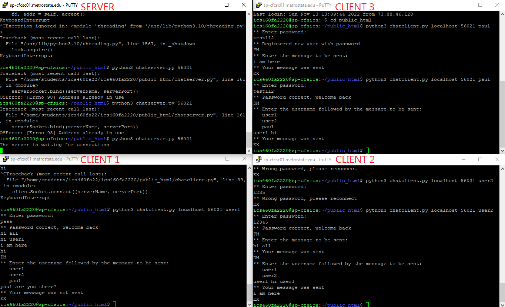

Assignment 3 ICS460
Paul Schmitz 11/13/2022

Instructions:
Launch the server using this command "python3 chatserver.py <port>". Launch clients using this command "python3 chatclient.py <servername> <port> <username>". For a new user, enter any desired password. For an existing user, enter the previously registered password. These are stored in userdata.txt on the server.

A client can enter one of three commands (case-sensitive): PM, DM, or EX. After entering PM, server will ask for the message which should be entered next. After entering DM, server will ask for the recipient user and message which should be entered next with a space separating them. Entering EX will close the client and remove the server connection.

Examples:
Launch Server:
python3 chatserver.py 56021

Launch Client:
python3 chatclient.py localhost 56021 user1
Send DM:
DM
user2 hello

Files:
chatserver.py - the server program
chatclient.py - the client program
userdata.txt - record of registered users and passwords
screenshot.png - screenshot of example process
readme.txt - this file

Sources:
https://www.geeksforgeeks.org/python-dictionary/?ref=lbp
https://www.w3schools.com/python/ref_string_split.asp
https://www.geeksforgeeks.org/python-different-ways-to-kill-a-thread/
